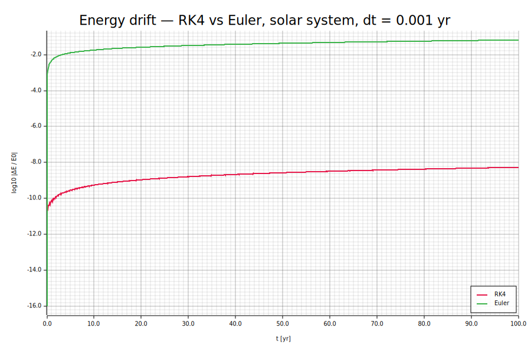
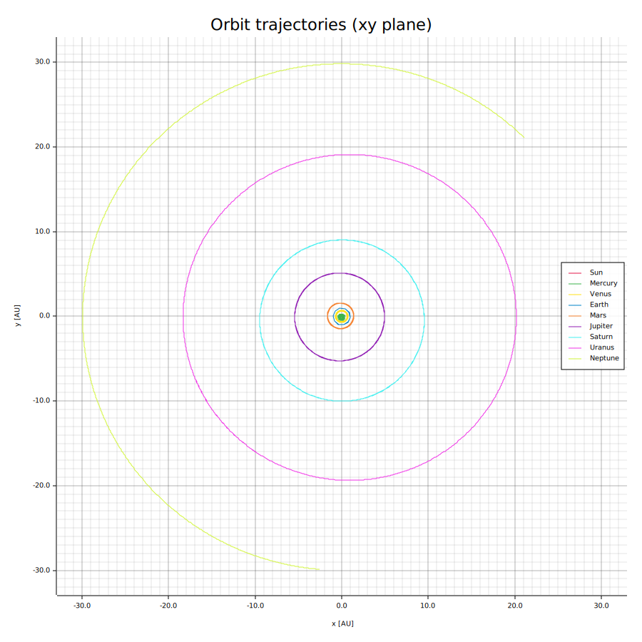

# N-Body Gravity Simulation

A high-performance N-body gravitational simulation written in Rust. Implements 4th-order Runge-Kutta (RK4) numerical integration with data-parallel force computation via Rayon.

Units throughout: **AU, years, solar masses** — so G = 4π² and Earth's orbit is the unit circle with period 1.

## Features

- **RK4 integration** — measured energy drift of 5×10⁻⁹ over a 100-year solar-system run, seven orders of magnitude better than Euler at the same time step (see below)
- **Parallel force computation** — the O(N²) loop is distributed across all CPU cores via [rayon](https://crates.io/crates/rayon)
- **Softening parameter** — prevents numerical instability during close encounters: |r|³ → (|r|² + ε²)^(3/2); the potential uses the matching softened form so E = K + U stays exactly consistent with the force law
- **Energy & momentum tracking** — total E = K + U and angular momentum **L** computed at every snapshot for drift analysis
- **JSON input** — initial conditions as heliocentric state vectors (JPL Horizons-compatible format); the bundled solar system is derived from J2000 mean orbital elements, planets at perihelion
- **CSV output** — positions and velocities plus a separate energy/drift time series
- **SVG plots** — orbit trajectories and energy drift, generated with [plotters](https://crates.io/crates/plotters)

## Installation

Requirements: Rust 1.75+ ([rustup.rs](https://rustup.rs))

```
git clone https://github.com/Sabfodel/N-Body-Gravity-Simulation-Computational-Astrophysics.git
cd N-Body-Gravity-Simulation-Computational-Astrophysics
cargo build --release
```

## Usage

```
cargo run --release -- --input data/solar_system.json --dt 0.001 --years 100 --plot
```

| Argument | Description | Default |
|---|---|---|
| `--input` | Initial conditions JSON file | `data/solar_system.json` |
| `--dt` | Time step (years) | `0.001` |
| `--years` | Total simulation duration (years) | `100` |
| `--softening` | Softening length ε (AU) | `1e-4` |
| `--integrator` | `rk4` or `euler` | `rk4` |
| `--snapshot-every` | Write every N-th step | `100` |
| `--output` | CSV output file | `output/sim.csv` |
| `--plot` | Also write orbit + drift SVGs | off |

The simulation shifts everything into the centre-of-mass frame at start-up, so total momentum is exactly zero and the system doesn't wander off the plot.

## Project Structure

```
├── src/
│   ├── main.rs          # CLI argument parsing, simulation loop
│   ├── body.rs          # Body (JSON schema) + State (positions/velocities)
│   ├── integrator.rs    # RK4 and Euler steppers
│   ├── forces.rs        # Softened gravity, rayon-parallel + serial reference
│   ├── io.rs            # JSON reader, CSV writer
│   ├── analysis.rs      # Energy, momentum, angular momentum, drift
│   └── plot.rs          # Orbit and drift SVGs (plotters)
├── examples/
│   ├── kepler_validation.rs   # Two-body test vs analytical solution
│   ├── drift_comparison.rs    # RK4 vs Euler energy drift figure
│   └── benchmark.rs           # Serial vs parallel force timing
├── tests/
│   └── physics.rs       # Conservation laws, Kepler's third law
├── data/
│   └── solar_system.json
└── assets/
    ├── orbit_plot.svg
    └── energy_drift.svg
```

## Results

### Kepler validation

Two-body Sun–Earth system started at perihelion (a = 1 AU, e = 0.0167), RK4 with dt = 10⁻⁴ yr, compared against the analytical solution (`cargo run --release --example kepler_validation`):

| Parameter | Analytical | Simulation | Rel. error |
|---|---|---|---|
| Orbital period | 365.2495 days | 365.2683 days | 5.2×10⁻⁵ |
| Eccentricity | 0.01670 | 0.01670 | 2.9×10⁻¹¹ |

(The period error is dominated by the perihelion-detection resolution, half a time step ≈ 0.018 days, not by the integrator.)

### Energy drift — RK4 vs Euler

Full 9-body solar system, 100 years, dt = 0.001 yr (`cargo run --release --example drift_comparison`):

| Integrator | Final \|ΔE/E₀\| |
|---|---|
| RK4 | 5.4×10⁻⁹ |
| Euler | 6.5×10⁻² |



### Orbit plot

100-year solar system trajectories in the ecliptic plane:



### Benchmark — serial vs Rayon

Force computation on a random cluster, best of 20 runs, 16 logical cores (`cargo run --release --example benchmark`):

| N | Serial | Rayon | Speedup |
|---|---|---|---|
| 100 | 0.027 ms | 0.026 ms | 1.0× |
| 500 | 0.774 ms | 0.134 ms | 5.8× |
| 1000 | 2.833 ms | 0.463 ms | 6.1× |
| 2000 | 11.668 ms | 1.845 ms | 6.3× |

Parallelism pays off once N is large enough to amortise the thread-pool overhead — at N = 100 the O(N²) loop is simply too cheap to split.

## Testing

```
cargo test
```

Tests check physics, not just code paths:

- **Newton's third law** — net force on the system vanishes for arbitrary configurations
- **Serial/parallel agreement** — rayon and serial force paths produce identical accelerations
- **Conservation** — energy (< 10⁻¹⁰ relative drift over 10 orbits), angular momentum, and momentum under RK4
- **RK4 vs Euler** — RK4's drift is verified to be > 10⁶× smaller at equal dt
- **Kepler's third law** — measured period matches T = 2π√(a³/G(M+m)) with the two-body correction

## Theoretical Background

The equation of motion for body *i* in an N-body system:

$$\ddot{\mathbf{r}}_i = -G \sum_{j \neq i} \frac{m_j (\mathbf{r}_i - \mathbf{r}_j)}{|\mathbf{r}_i - \mathbf{r}_j|^3}$$

Softening correction applied to avoid singularities at small separations:

$$|\mathbf{r}|^3 \rightarrow \left(|\mathbf{r}|^2 + \varepsilon^2\right)^{3/2}$$

The system is integrated with the classical 4th-order Runge-Kutta method at fixed Δt: four force evaluations per step give O(Δt⁴) local accuracy, so halving Δt reduces the energy drift ~16×. Total energy E = K + U and angular momentum **L** are tracked throughout to validate numerical accuracy.

## Dependencies

| Crate | Purpose |
|---|---|
| [nalgebra](https://crates.io/crates/nalgebra) | 3D vector operations |
| [rayon](https://crates.io/crates/rayon) | Data parallelism |
| [serde](https://crates.io/crates/serde) + serde_json | JSON deserialization |
| [plotters](https://crates.io/crates/plotters) | SVG plot generation |

## References

- Carroll, B. W. & Ostlie, D. A. (2017). *An Introduction to Modern Astrophysics*. Cambridge University Press.
- Hairer, E., Nørsett, S. P. & Wanner, G. (1993). *Solving Ordinary Differential Equations I*. Springer.
- NASA JPL Horizons System: https://ssd.jpl.nasa.gov/horizons/

## License

MIT © Sabri Aydın
